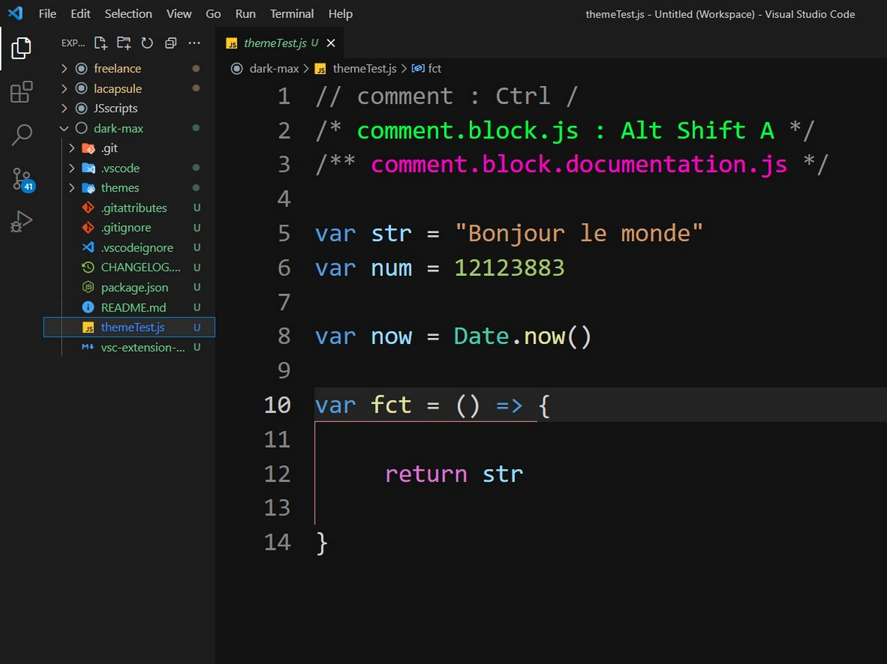

*Visual Studio SCode theme*
# dark max

This theme is a more contrasted version of the default dark/dark+ theme ...with a few other cool tweaks ◼🌈
*darker background*
*colors popping off a little bit more*
*more colors for comments in JS files*

The default Dark+ theme is my favorite but I needed to find my way around my code better 🤓. This is how this theme was born...

## Screenshot

